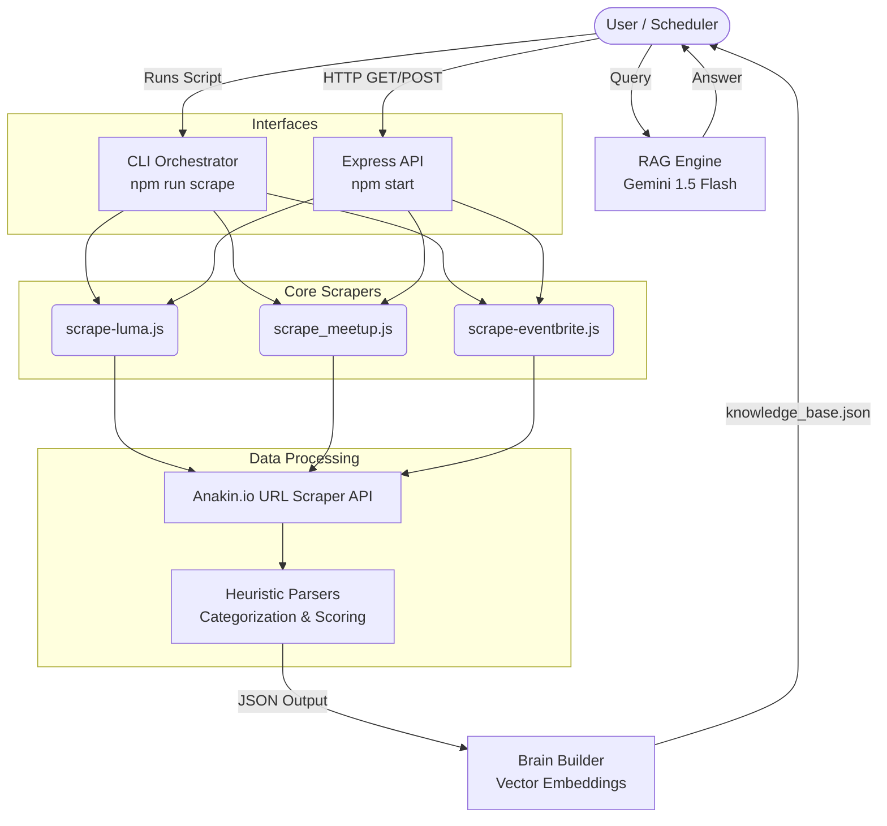

# Anakin Event Scraper

A robust, deterministic web scraping and aggregation engine for tech events in Bengaluru. Powered by [Anakin.io's API](https://anakin.io/) and built with Node.js, this system uses advanced Apollo State extraction and Cheerio DOM traversal to reliably scrape networking and technical events from Luma, Meetup, and Eventbrite.

---

## 🏗 System Architecture



## 🚀 Setup & Installation

1. **Install Dependencies**
   ```bash
   npm install
   ```

2. **Environment Variables**
   Create a `.env` file in the root directory:
   ```env
   ANAKIN_API_KEY=your_actual_api_key_here
   GEMINI_API_KEY=your_google_ai_studio_key
   PORT=3000
   ```

## 💻 Usage

### 1. Interactive CLI (Temporary Session Mode)

Run the full suite using the newly added NPM script:
```bash
npm run scrape
```

- This triggers `scrape-all.js` which sequentially runs Luma, Meetup, and Eventbrite scrapers.
- **Temporary Output:** It writes `luma_results.json`, `meetup_results.json`, and `eventbrite_results.json` locally.
- **Auto-Cleanup:** The terminal will remain open in an interactive wait state. When you are done, press `Ctrl+C` or type `exit` and the system will automatically securely delete the temporary JSON files.
- **AI Brain Building:** After scraping, it automatically runs `brain-builder.js` to index the data for the RAG model.

### 2. Express API Mode

Start the API server:
```bash
npm start
```

The server supports both `GET` and `POST` methods, allowing you to pass parameters via query strings or JSON body payloads.

**Endpoints:**
- `GET / POST /api/scrape/luma`
- `GET / POST /api/scrape/meetup` (Accepts `location` and `dateRange` params)
- `GET / POST /api/scrape/eventbrite`
- `GET / POST /api/scrape/all`
- `GET / POST /api/chat` (AI-powered natural language query)

**Example RAG Query:**
```bash
curl -X POST http://localhost:3000/api/chat \
-H "Content-Type: application/json" \
-d '{"query": "Are there any AI networking events in Bangalore this weekend?"}'
```

*Example POST request:*
```bash
curl -X POST http://localhost:3000/api/scrape/meetup \
-H "Content-Type: application/json" \
-d '{"location": "in--Bangalore", "dateRange": "this-week"}'
```

## 🧠 Data Processing Heuristics

All incoming scraped data passes through the `src/parsers` engine, which applies:
- **Geo-Mapping:** Infers precise Latitude/Longitude coordinates based on Bangalore neighborhood names.
- **Semantic Tagging:** Auto-categorizes events (e.g., `AI`, `Technical`, `Networking`) based on title keywords.
- **Score Generation:** Assigns a `networkingScore` and `technicalScore` out of 10 to help prioritize highly valuable events.
